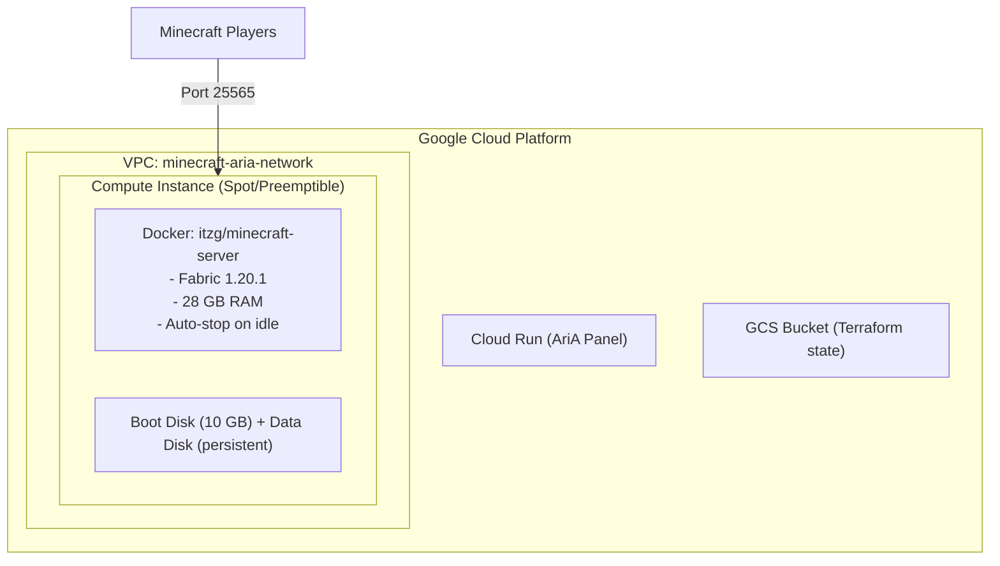

# aria-minecraft-server-iac

## Architecture

```mermaid
graph TD
    subgraph GCP[Google Cloud Platform]
        subgraph VPC["VPC: minecraft-aria-network"]
            subgraph VM["Compute Instance (Spot/Preemptible)"]
                Docker["Docker: itzg/minecraft-server<br/>- Fabric 1.20.1<br/>- 28 GB RAM<br/>- Auto-stop on idle"]
                Disks["Boot Disk (10 GB) + Data Disk (persistent)"]
            end
        end

        Panel["Cloud Run (AriA Panel)"]
        Bucket["GCS Bucket (Terraform state)"]
    end

    Players["Minecraft Players"]

    Players -- "Port 25565" --> VM
```
